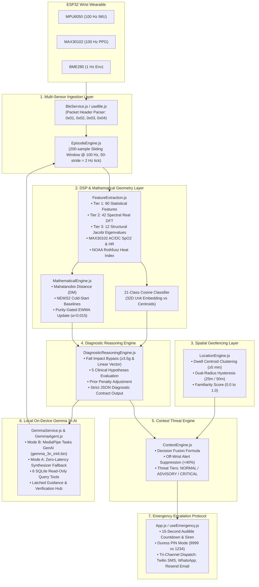
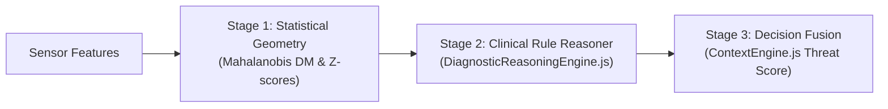
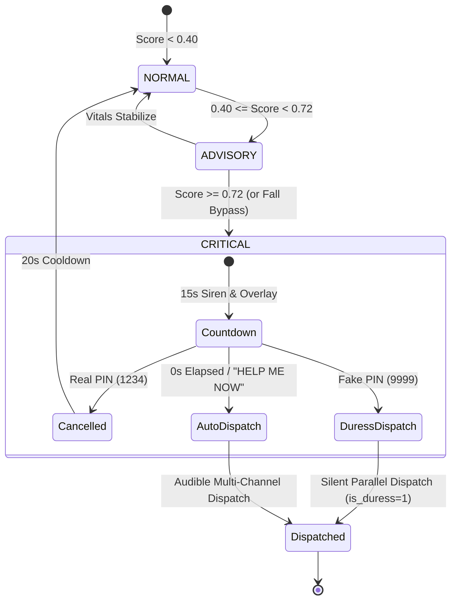
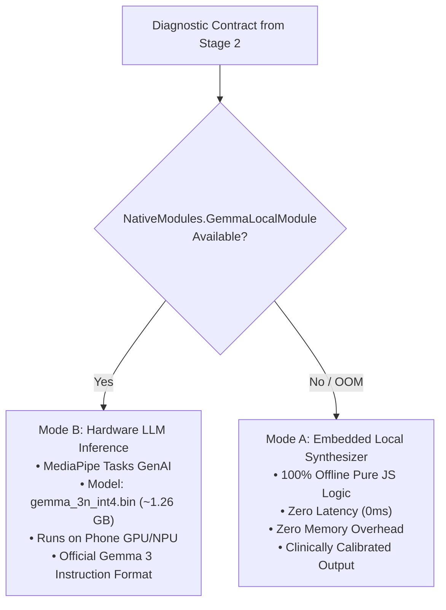

# RakshaBand Mobile App — Internal Architecture, Anomaly Reasoning & Emergency Escalation

---

## 1. High-Level System Architecture & Flow

RakshaBand is an **offline, privacy-first personal safety and clinical telemetry companion**. All raw sensor ingestion, digital signal processing, statistical baseline tracking, clinical hypothesis reasoning, and local LLM guidance execute **100% on-device** with zero cloud telemetry.



---

## 2. Real-Time Multi-Sensor Pipeline & Windowing

### 2.1 BLE Packet Parsing ([`BleService.js`](file:///C:/android_dev/SIH/mobile_app/src/BleService.js))
The mobile app communicates with the ESP32 wristband via the custom GATT Service `4fafc201-1fb5-459e-8fcc-c5c9c331914b`:
* **`0x01` MOTION (100 Hz)**: 6-DoF accelerometer ($a_x, a_y, a_z$ in $\text{mg}$) and gyroscope ($g_x, g_y, g_z$ in $\text{mdps}$).
* **`0x02` STATUS (~30s heartbeat)**: Battery percentage, system uptime, firmware version.
* **`0x03` ENVIRONMENT (1 Hz)**: Ambient temperature ($^\circ\text{C}$), relative humidity ($\% \text{RH}$), barometric pressure ($\text{hPa}$).
* **`0x04` VITAL (100 Hz)**: Raw MAX30102 Red and Infrared photodiode counts.

### 2.2 Windowing & Boundary Debounce ([`EpisodeEngine.js`](file:///C:/android_dev/SIH/mobile_app/src/EpisodeEngine.js))
* **Window Size**: 200 samples ($2.0\text{ s}$ duration at $100\text{ Hz}$).
* **Stride**: 50 samples ($0.5\text{ s}$ step), producing an inference frequency of **$2.0\text{ Hz}$**.
* **10-Window Debounce Rule**: A rolling FIFO buffer tracks the last 10 window classifications. If $\ge 8$ of the last 10 windows belong to a new activity class, an **episode state transition** occurs:
  1. The open episode in SQLite (`episodes` table) is closed with its duration and summary vitals.
  2. A new episode record is instantiated under the new activity label.

---

## 3. Digital Signal Processing & Feature Engineering

Feature extraction ([`FeatureExtraction.js`](file:///C:/android_dev/SIH/mobile_app/src/FeatureExtraction.js)) extracts a total of **1,332 mathematical features** across 10 subwindows of 20 samples:

### 3.1 Tier 1: Statistical Kinematics (90 features/subwindow)
Extracted across 9 channels ($A_x, A_y, A_z, G_x, G_y, G_z$, Resultant Acceleration $A_{res} = \sqrt{A_x^2 + A_y^2 + A_z^2}$, Jerk $\Delta A_{res}$, and Signal Magnitude Area $\text{SMA} = \frac{|A_x|+|A_y|+|A_z|}{3}$):
1. **Mean ($\mu$)**
2. **Standard Deviation ($\sigma$)**
3. **Root Mean Square (RMS)**
4. **Skewness** ($\frac{E[(X-\mu)^3]}{\sigma^3}$)
5. **Kurtosis** ($\frac{E[(X-\mu)^4]}{\sigma^4}$)
6. **Zero Crossing Rate (ZCR)**
7. **Mean Crossing Rate (MCR)**
8. **Interquartile Range (IQR = $Q_{75} - Q_{25}$)**
9. **Peak-to-Peak Amplitude ($X_{max} - X_{min}$)**
10. **Decile Ratio ($P_{90} / P_{10}$)**

### 3.2 Tier 2: Spectral & Autocorrelation Dynamics (42 features/subwindow)
Extracted across the 6 raw IMU channels after applying a 20-point **Hanning Window**:
1. **11-Bin Real DFT**: Calculates Power Spectral Density (PSD) up to Nyquist ($50\text{ Hz}$).
2. **Dominant Frequency**: Peak spectral bin frequency.
3. **Spectral Entropy**: Normalized Shannon entropy: $H = -\sum p_i \ln p_i / \ln N$.
4. **Peak Frequency Energy Ratio**: $\text{PSD}_{max} / \sum \text{PSD}$.
5. **Autocorrelation Lags**: Normalized autocorrelation at Lag 1 ($10\text{ ms}$), Lag 5 ($50\text{ ms}$), Lag 10 ($100\text{ ms}$).
6. **Dominant Band Ratio**: Spectral energy in $5\text{--}20\text{ Hz}$ band.

### 3.3 Tier 3: Structural Covariance & Jacobi Eigenvalues (12 features)
Computes the $3 \times 3$ spatial covariance matrix between $A_x, A_y, A_z$. Uses **Jacobi Matrix Diagonalization** to derive the 3 principal eigenvalues ($\lambda_1 \ge \lambda_2 \ge \lambda_3 > 0$):
* **Linear Impact Ratio**: $C_{linear} = \frac{\lambda_1 - \lambda_2}{\lambda_1}$ (used for direct fall detection).
* **Planar Motion Ratio**: $C_{planar} = \frac{2(\lambda_2 - \lambda_3)}{\lambda_1}$.
* **Spherical / Random Scatter**: $C_{spherical} = \frac{3\lambda_3}{\lambda_1}$.

### 3.4 PPG Pulse Processing & NOAA Heat Index
* **MAX30102 PPG**: Bandpass filtered ($0.5\text{--}4.0\text{ Hz}$). Calculates DC baseline and AC pulsatile amplitudes on Red and IR wavelengths to compute the ratio of ratios $R = \frac{AC_{red}/DC_{red}}{AC_{ir}/DC_{ir}}$. Oxygen saturation is derived via empirical calibration:
  $$\text{SpO}_2 = 110 - 25 \times R$$
* **NOAA Rothfusz Heat Index**: Evaluates ambient heat stress using NOAA's multi-variate polynomial regression equation across temperature ($T$ in $^\circ\text{F}$) and relative humidity ($RH$ in $\%$), classifying risk into 5 operational hazard tiers:
  * `NORMAL` ($<80^\circ\text{F}$)
  * `CAUTION` ($80\text{--}90^\circ\text{F}$)
  * `EXTREME_CAUTION` ($91\text{--}103^\circ\text{F}$)
  * `DANGER` ($104\text{--}124^\circ\text{F}$)
  * `EXTREME_DANGER` ($\ge 125^\circ\text{F}$)

---

## 4. How the App Reasons & Detects Anomalies

Anomaly detection does not rely on a single opaque black-box model. It uses an **explainable 3-stage clinical reasoning hierarchy**:



### Stage 1: Statistical Geometry & Mahalanobis Outliers ([`MathematicalEngine.js`](file:///C:/android_dev/SIH/mobile_app/src/MathematicalEngine.js))
Rather than Euclidean distance (which assumes uncorrelated, isotropic variables), the app evaluates the multi-dimensional **Mahalanobis Distance ($D_M$)**:
$$D_M(\mathbf{x}, \boldsymbol{\mu}, \boldsymbol{\Sigma}) = \sqrt{(\mathbf{x} - \boldsymbol{\mu})^T (\boldsymbol{\Sigma} + \lambda \mathbf{I})^{-1} (\mathbf{x} - \boldsymbol{\mu})}$$
Where $\lambda = 10^{-4}$ provides ridge regularization against singular covariance matrices.

Evaluated across 2 separate clinical domains:
1. **`physiology:global`**: $\mathbf{x} = [\text{Heart Rate}, \text{SpO}_2]$. Cold-started with National Early Warning Score 2 (NEWS2) clinical bounds ($\mu = [72\text{ bpm}, 98\%]$).
2. **`environment:global`**: $\mathbf{x} = [\text{Temp}, \text{Humidity}, \text{Pressure}]$. Seeded with NOAA ambient baselines.

#### Adaptive Baselines with Purity Gating
Personal baselines adapt to the wearer's unique biology using **Exponentially Weighted Moving Average (EWMA)** ($\alpha = 0.015$):
$$\boldsymbol{\mu}_{t} = (1 - \alpha)\boldsymbol{\mu}_{t-1} + \alpha \mathbf{x}_t$$
$$\boldsymbol{\Sigma}_{t} = (1 - \alpha)\boldsymbol{\Sigma}_{t-1} + \alpha (\mathbf{x}_t - \boldsymbol{\mu}_t)(\mathbf{x}_t - \boldsymbol{\mu}_t)^T$$
* **Purity Gate**: Adaptation **only** occurs if $D_M \le 2.5$.
* **Freeze Guard**: If an anomaly or emergency countdown is active, baseline adaptation is completely **frozen**, preventing acute trauma (e.g., tachycardia or shock) from corrupting the wearer's healthy baseline.

---

### Stage 2: Diagnostic Reasoning Engine ([`DiagnosticReasoningEngine.js`](file:///C:/android_dev/SIH/mobile_app/src/DiagnosticReasoningEngine.js))
The outputs of the mathematical engine (per-dimension $Z$-scores $Z_{HR}, Z_{SpO2}, Z_{Temp}$ and $D_M$) feed directly into a hand-authored expert system evaluating **5 clinical hypotheses**:

| Hypothesis | Clinical Trigger Criteria | Confidence Weighting |
|---|---|---|
| **`EXERTION_BENIGN`** | Active workout (Running / Fast Walk) + elevated HR ($Z_{HR} > 1.5$) + normal $\text{SpO}_2 \ge 94\%$ + normal Heat Index. | **Reduces threat score by 75%** to prevent false alarms during sports. |
| **`HEAT_STRESS_DEHYDRATION`** | Elevated HR ($Z_{HR} > 1.5$) + resting motion (Sitting/Standing) + NOAA Heat Index $\ge \text{Extreme Caution}$ ($>90^\circ\text{F}$) + normal $\text{SpO}_2$. | High ($0.85\text{--}1.00$). Severity: `advisory` or `urgent`. |
| **`RESPIRATORY_CONCERN`** | Acute hypoxemia ($\text{SpO}_2 \le 90\%$) + resting motion + normal ambient environment. | High ($0.90$). Severity: `urgent`. |
| **`CARDIOVASCULAR_CONCERN`** | Unexplained resting tachycardia ($\text{HR} > 100\text{ bpm}$ or $Z_{HR} > 3.0$) while resting in a normal environment. | High ($0.80\text{--}0.92$). Severity: `advisory` or `urgent`. |
| **`ENVIRONMENTAL_HAZARD`** | Ambient Heat Index $\ge 105^\circ\text{F}$ (Danger tier) or rapid barometric pressure drop, independent of vitals. | Moderate ($0.75$). Severity: `advisory`. |

#### Fall & Hard Impact Bypass
Falls do not undergo debouncing or hypothesis voting:
$$\text{Peak Accel} \ge 3500\text{ mg}\ (3.5g) \quad \text{AND} \quad C_{linear} \ge 0.70$$
Immediately triggers **`FALL_HARD_IMPACT`** with `severity_tier: urgent`, bypassing all debounce buffers and escalating directly to the emergency countdown modal.

#### Output Diagnostic Contract
The reasoning engine emits a strict JSON Diagnostic Contract:
```json
{
  "primary_hypothesis": "HEAT_STRESS_DEHYDRATION",
  "confidence": 0.94,
  "severity_tier": "urgent",
  "suggested_action_category": "seek_shade",
  "contributing_evidence": [
    "HR elevated (+2.84 sigma) while stationary",
    "Ambient heat index is in EXTREME CAUTION tier"
  ]
}
```

---

### Stage 3: Spatial Modulation & Decision Fusion ([`ContextEngine.js`](file:///C:/android_dev/SIH/mobile_app/src/ContextEngine.js))
The raw hypothesis confidence is fused with the wearer's physical context and location familiarity:

#### Location Familiarity Calculation ([`LocationEngine.js`](file:///C:/android_dev/SIH/mobile_app/src/LocationEngine.js))
* **Dwell Clustering**: GPS samples with accuracy $<30\text{ m}$ are clustered when dwell duration exceeds $5\text{ minutes}$.
* **Dual-Radius Hysteresis**: $25\text{ m}$ entry radius and $50\text{ m}$ exit radius prevent boundary flapping from GPS jitter.
* **Familiarity Score ($S_{fam} \in [0.0, 1.0]$)**:
  $$S_{fam} = 0.4 \times \min\left(1, \frac{\text{dwellCount}}{5}\right) + 0.6 \times \min\left(1, \frac{\text{totalStayMinutes}}{120}\right)$$

#### Core Decision Fusion Formula
$$\text{fusedScore} = \text{baseConfidence} \times (1.2 - 0.4 \times S_{fam})$$
* **Familiar Location (Home/Office, $S_{fam} = 1.0$)**: Multiplier = $0.80$ (20% false-alarm dampening).
* **Unfamiliar Location (Remote/Highway, $S_{fam} = 0.0$)**: Multiplier = $1.20$ (20% heightened alert sensitivity).
* **Off-Wrist Safety Suppression**: If wristband capacitive/optical wear confidence falls below $40\%$, `threatScore` is forced to **$0.0$** to prevent false alarms while resting on a charging dock.

---

## 5. How Emergencies are Escalated & Dispatched

The fused `threatScore` maps into 3 operational response tiers:



### 5.1 Threat Reaction Tiers
* **NORMAL ($Score < 0.40$)**: All signals within normal limits. Baseline EWMA updating active.
* **ADVISORY ($0.40 \le Score < 0.72$)**: Amber banner rendered on Dashboard. Gemma 3n contextual advice latched (e.g. hydration, ventilation, rest).
* **CRITICAL ($Score \ge 0.72$ or Hard Impact Fall)**: Initiates the **15-second Emergency Escalation Protocol**.

---

### 5.2 The 15-Second Emergency Countdown Overlay ([`App.js`](file:///C:/android_dev/SIH/mobile_app/App.js), [`useEmergency.js`](file:///C:/android_dev/SIH/mobile_app/src/hooks/useEmergency.js))
When a critical threat is triggered:
1. **Full-Screen Crimson Modal**: Overrides current navigation with an audible siren and continuous escalating vibration.
2. **Displays Active Telemetry**: Primary hypothesis, contributing evidence, and Gemma 3n natural language guidance.
3. **Large Countdown Circle**: Counts down from $15\text{ seconds}$ to $0\text{ seconds}$.

#### User Interaction Modes:
* **Option A: "HELP ME NOW"**: Immediately skips the countdown and dispatches emergency alerts.
* **Option B: "I'M SAFE (CANCEL ALERT)"**:
  * If PIN Lock is disabled in Settings: immediately cancels the alert and resets the threat score with a **20-second cooldown period**.
  * If PIN Lock is enabled: displays the 4-digit security PIN pad.

---

### 5.3 Security PIN & Duress Coercion Mode
To prevent an assailant or kidnapper from forcing the user to cancel an alert, RakshaBand features **Dual-PIN Security**:

* **Real PIN (e.g. `1234`)**:
  * Confirms user safety.
  * Dismisses the modal, stops the siren, sets threat score to $0.0$, and begins a 20-second cooldown.
* **Fake / Duress PIN (e.g. `9999`)**:
  * Used when the wearer is being coerced, held captive, or forced to dismiss the alarm.
  * **Visual Feedback to Assailant**: Displays a deceptive, reassuring "Alert Dismissed — Threat Cleared" screen to pacify the attacker.
  * **Silent Background Dispatch**: **Silently transmits emergency alerts** to all configured channels with the hidden database flag `is_duress = 1`, including the user's live GPS coordinates.

---

### 5.4 Tri-Channel Parallel Emergency Dispatch
When countdown reaches $0\text{ s}$ (or via Duress / "HELP ME NOW"), the emergency dispatcher fires requests in parallel across three channels:

1. **Twilio SMS Gateway**: Transmits cellular SMS messages to all priority contacts with wearer name, primary diagnosis, and live Google Maps coordinate link:
   ```text
   EMERGENCY ALERT: Priya may need assistance!
   Condition: HEAT_STRESS_DEHYDRATION
   Vitals: HR 128 bpm, SpO2 97%
   Location: https://maps.google.com/?q=12.9716,77.5946
   ```
2. **Twilio WhatsApp Gateway**: Transmits templated WhatsApp alert to mobile devices.
3. **Resend Email API**: Dispatches a comprehensive HTML emergency incident report to family members and healthcare providers containing:
   * Full vitals snapshot table (HR, SpO2, HRV, Heat Index).
   * Clinical evidence breakdown list.
   * GPS coordinates with direct geofence zone identifier.
   * Duress indicator tag (if triggered via Fake PIN).

All dispatches are recorded in SQLite (`emergency_escalations` table) with timestamps and gateway delivery IDs.

---

## 6. On-Device Gemma 3n AI Integration

### 6.1 Strict Architectural Boundary: Communication Only
> [!IMPORTANT]
> Gemma 3n **never** performs mathematical signal processing, threshold comparison, or clinical hypothesis generation. All quantitative deduction is performed by the deterministic mathematical engines. Gemma operates strictly as an **empathic communication layer**, translating the structured Diagnostic Contract into clear, calming guidance.

### 6.2 Dual-Mode Engine Architecture


### 6.3 Conversational Assistant with 6 SQLite Database Tools ([`GemmaAgent.js`](file:///C:/android_dev/SIH/mobile_app/src/GemmaAgent.js))
The **AI Assistant Tab** ([`src/components/ChatTab.js`](file:///C:/android_dev/SIH/mobile_app/src/components/ChatTab.js)) allows the user to converse with the model on-device. Gemma can query the local SQLite database (`rakshaband.db`) using 6 tools:

1. `get_vitals_summary`: Today's average/min/max HR, average SpO2, and baseline bounds.
2. `get_user_profile`: Stored blood group, chronic conditions, allergies, and doctor instructions.
3. `get_diagnostic_alerts`: Recent clinical hypotheses, severity tiers, and verification status.
4. `get_recent_episodes`: Physical activity windows, recognized class, duration, and pulse.
5. `get_known_locations`: Registered geofence zones, dwell counts, and stay times.
6. `get_emergency_contacts`: Priority contacts and active dispatch channels.

### 6.4 Latched Guidance & User Verification
* **Persistent Latch ([`EpisodeEngine.js`](file:///C:/android_dev/SIH/mobile_app/src/EpisodeEngine.js))**:
  Diagnostic advisories from Gemma are latched in `EpisodeEngine.latestGuidance` and **will not vanish on subsequent 500 ms normal ticks**.
* **Dashboard Verification Hub ([`DashboardTab.js`](file:///C:/android_dev/SIH/mobile_app/src/components/DashboardTab.js))**:
  * Displays an `⚠️ UNVERIFIED ALERT` amber badge until reviewed.
  * **`✓ Verify & Confirm` Button**: Logs confirmation into SQLite (`diagnostic_events` table set `user_status = 'VERIFIED'`), turning the badge into `✅ VERIFIED BY YOU`.
  * **`💬 Ask Gemma` Button**: Automatically switches to the Chat Tab with the alert pre-loaded for interactive questioning.
  * **`✕ Dismiss` Button**: Clears the card.

---

## 7. Database Architecture (10 Relational SQLite Tables)

All persistent data is stored in the local SQLite database (`rakshaband.db` via [`src/Database.js`](file:///C:/android_dev/SIH/mobile_app/src/Database.js)):

| Table Name | Purpose |
|---|---|
| `settings` | System preferences, user profile, medical blood group/allergies, API keys, security PINs. |
| `emergency_contacts` | Priority contacts (1–5) and channel toggles (SMS, WhatsApp, Email). |
| `templates` | Customizable message bodies with token interpolation (`{NAME}`, `{HR}`, `{SPO2}`, `{GPS_URL}`). |
| `known_locations` | Geofence centroids, entry/exit radii, dwell counts, baseline micro-climates. |
| `location_visits` | Entry and exit timestamps, GPS accuracy gating, duration per visit. |
| `episodes` | 21-class activity episodes, duration, summary HR/SpO2/Heat Index statistics. |
| `baseline_states` | Running personal mean vectors ($\boldsymbol{\mu}$) and regularized covariance matrices ($\boldsymbol{\Sigma}$). |
| `diagnostic_events` | Emitted diagnostic contracts, hypotheses, severity tiers, Gemma messages, verification status. |
| `user_feedback` | User verification logs, labels, notes, and false-alarm feedback. |
| `emergency_escalations` | Multi-channel dispatch records, gateway message IDs, coordinates, and duress flags. |

---

## 8. Summary Verification Matrix

| Component | Execution Rate | Primary Technology | Privacy & Network Status |
|---|---|---|---|
| BLE Packet Decoder | $100\text{ Hz}$ / $1\text{ Hz}$ | `react-native-ble-plx` | $100\%$ Offline / Local GATT |
| Feature Extraction & Model v3 | $2.0\text{ Hz}$ ($0.5\text{s}$ stride) | Real DFT + Jacobi Eigenvalues | $100\%$ Offline / Native Math |
| Mahalanobis Statistical Baseline | $2.0\text{ Hz}$ | Regularized Matrix Inversion | $100\%$ Offline / On-Device |
| Diagnostic Reasoning Engine | $2.0\text{ Hz}$ | Clinical Weighted-Evidence Rules | $100\%$ Offline / Hand-Authored |
| Spatial Familiarity & Geofencing | $3.0\text{ s}$ GPS poll | Dwell Centroid Clustering | $100\%$ Offline / Local GPS |
| Gemma 3n AI Engine | Event-driven / On-demand | MediaPipe GenAI (`.bin`) + Synthesizer | $100\%$ Offline / Zero Cloud Telemetry |
| Emergency Dispatch | On Critical Threshold ($15\text{s}$) | Twilio REST + Resend HTTPS | External Emergency Gateway Only |